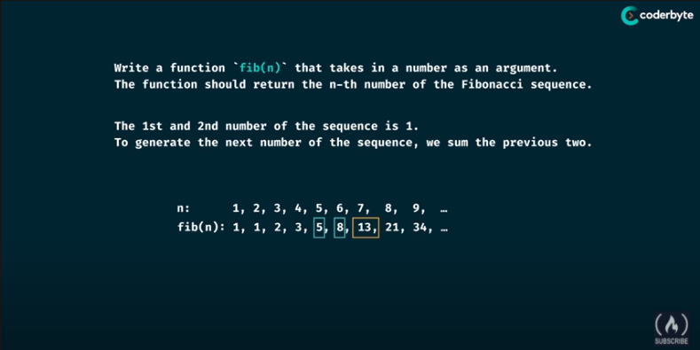
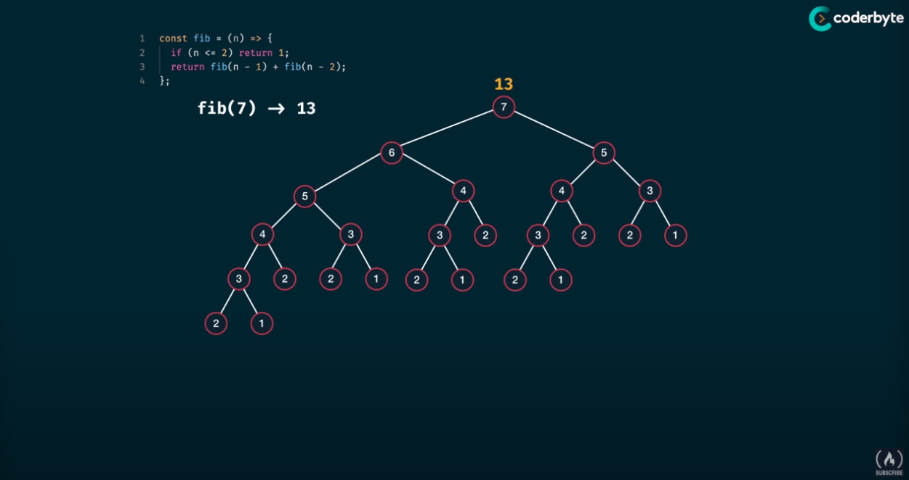
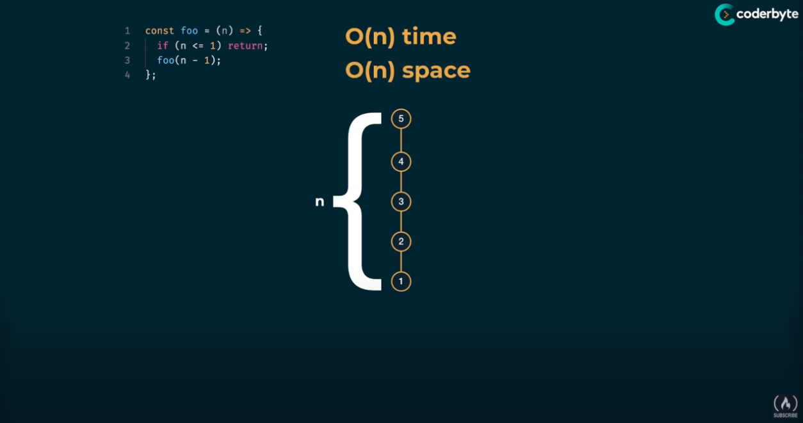
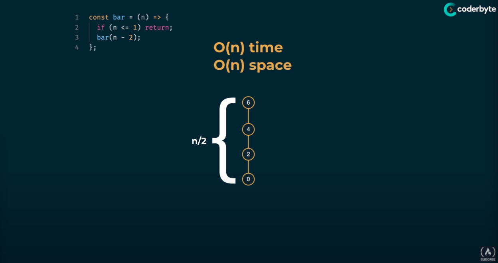
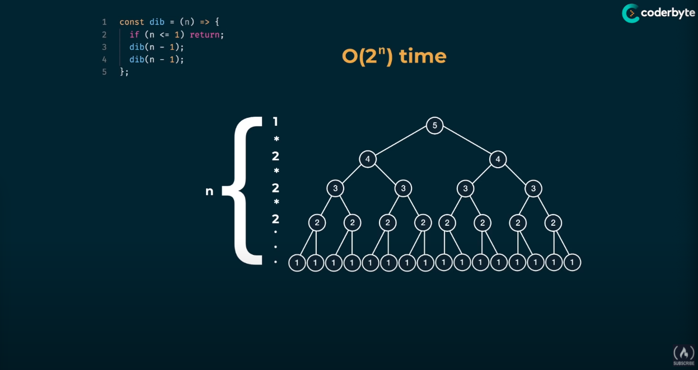
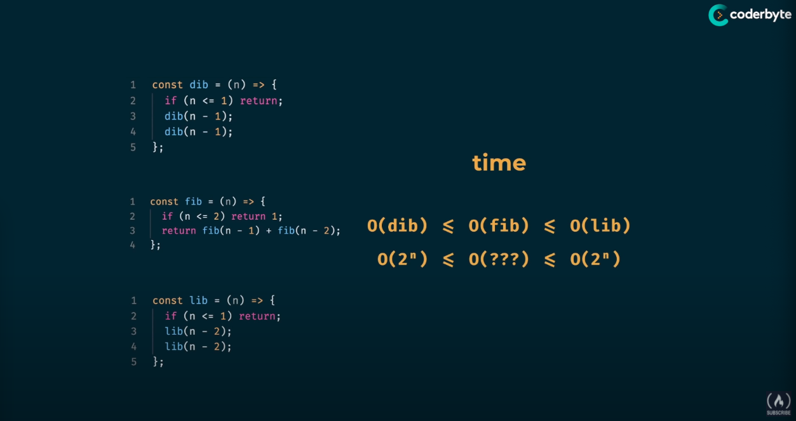
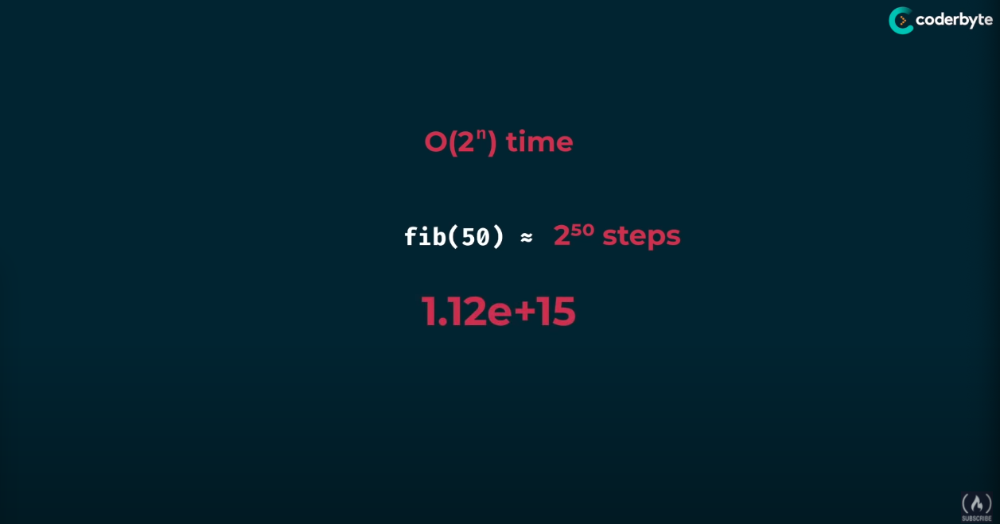

# Fibonacci sequence

Write a function ```fib(n)``` that takes in a number as an argument. 

The function should return the n-th number of the Fibonacci sequence.

The 1st and 2nd number of the sequence is 1.

To generate the next number of the sequence, we sum the previous two.



Explain the classic solution

# Basic Understanding of Complexity of recursive function
## Single recursive function




## Two recursive function




## Fib recurive function





## How to solve the problem

